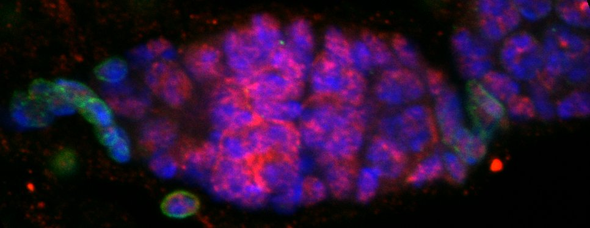

***    
I am interested in studying a *Drosophila* protein Rbfox1. It is homologous to human Rbfoxes, the deregulation of which has been associated with multiple different diseases, such as autism, obesity, diabetes, congenital heart defects, ALS, and spinocerebelar ataxia.

Just look at these awesome flies I work with (their eyes glow green and red due to Green Fluorescent Protein (GFP) and Red Fluorescent Protein (RFP), used as markers to determine which fly has a mutated gene):

Rbfox1 undergoes liquid-liquid phase separation in cells, by associating with other proteins. The secret lies in Low Complexity Sequence Domains, also known as LCDs. These domains allow different proteins to coalesce into droplets, otherwise known as **liquid granules**. Such membraneless organelles allow the protein to hold onto mRNA and to prevent its

 translation  
 modification  
 miRNA-mediated mRNA degradation  

Liquid-liquid phase separation (taken from Hondele et al., 2020):

***
A good system to study phase separation is the Drosophila ovaries. These tissues have large germline cells, with large nuclei and vast cytoplasmic content. In addition, there are a few different populations of somatic (non-germline) cells in an ovary, such as the stem cell niche cells.

Here you can see an example of a Drosophila ovary:  

***
References

Hondele, M., Heinrich, S., De Los Rios, P., & Weis, K. (2020). Membraneless organelles: Phasing out of equilibrium. Emerging Topics in Life Sciences. https://doi.org/10.1042/ETLS20190190